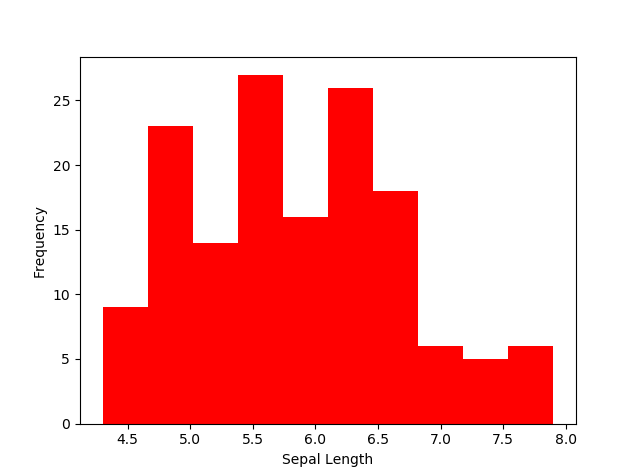
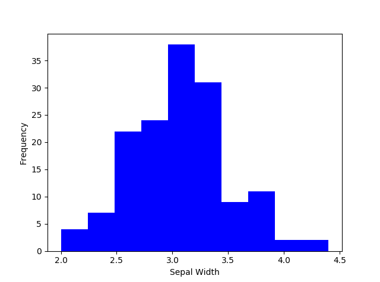
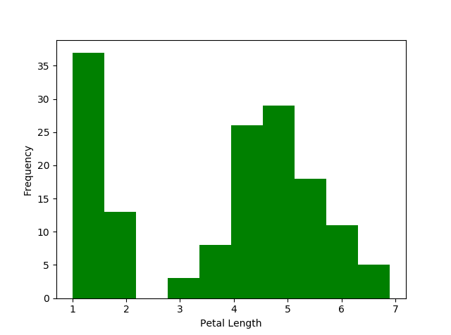
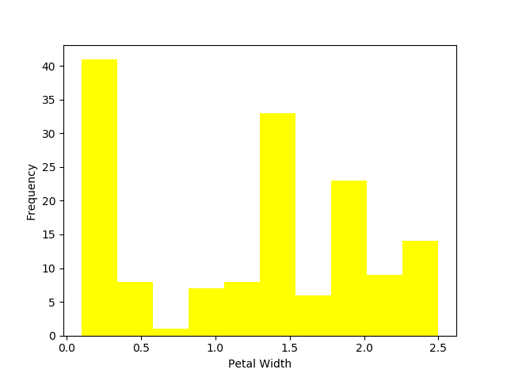
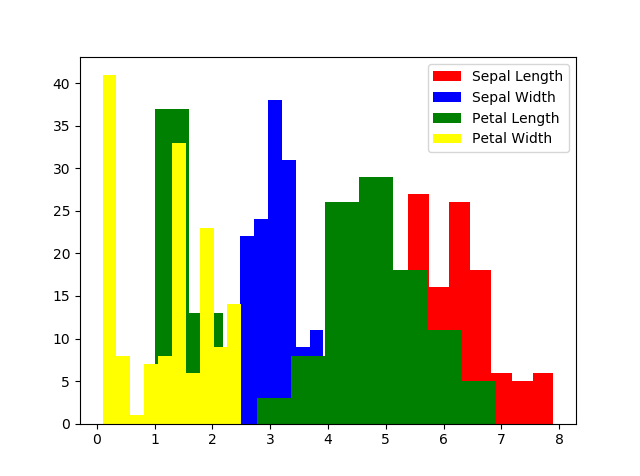

# python-project
Programming &amp; Scripting module project on Fisher's Iris data set.

### Summary of background information
Fisher's Iris data set was established by British statistician Ronald Fisher in 1936 and it is one of the first standard models of statistical classification.  The data set contains 50 samples each of three types of Iris flowers (Iris setosa, Iris virginica and Iris versicolor) measured along four variables - the measurements in centimetres of sepal length, sepal width, petal length and petal width. It has become one of the most widely used data test cases for many [statistical classification techniques](https://en.wikipedia.org/wiki/Iris_flower_data_set) as well as [pattern recognition](https://archive.ics.uci.edu/ml/datasets/iris) and [data visualisation](http://www.idvbook.com/teaching-aid/data-sets/the-iris-data-set).

While researching for this project I found a [blog](https://joelkuiper.eu/R-workshop) detailing some exercises (albeit in R) that I borrowed to use as a guideline for a script to write to investigate the data set and help me get to grips with the different ways this could be done. Further online research led me to understand the need to import a library into my Python code to better facilitate this analysis, and I first decided to try [Pandas](https://pandas.pydata.org/pandas-docs/stable/).  My understanding of this package is that it provides the means to efficiently analyse and model data as it incorporates the functionlity of NumPy and MatPlotLib as well as its own particular features. It is also already included in the version of Anaconda I have downloaded to my machine so it was quite simple to import it, and use it to open the data set from a .csv (comma separated value) file I had downloaded. 

My script demonstrating these exercises is saved in this repository as **Project1.py**  

### Project1.py includes code to:
1.  Select only the rows of the Virginica flowers and assign it to virginica  
*This was achieved by creating a dataframe and labelling its columns which then allowed for selection of the rows from the column        labelled "Species" containing "Iris-virginica" and assigning them to a variable named "virginica"*.  
2.  Select only the Sepal Length of the Virginica flowers and assign it  
*I did this by creating a variable named "vsepallength" which was assigned to an argument calling the sepal length of the "virginica" variable above*.
3.  Calculate the mean, median, variance and standard deviation of the Virginica Sepal Length  
*This utilised the "vsepallength" variable described in list number 2 and calling Pandas to calculate and print its mean, median, variance and standard deviation.*
4.  Select only the numerical columns  
*This was achieved by creating another variable, this time named "selectnumcol" and allocating it to the 4 columns that contain numerical data.*
5.  Calculate the mean of all the numerical variables  
*Demonstrating this involved calling Pandas to calcuate and print the mean of each column of numerical data individually and also, writing a command to calculate and print the mean of all 4.* 

I learned how to execute the above steps mostly from reading the [Pandas Tutorial](https://pandas.pydata.org/pandas-docs/stable/tutorials.html) which helped me to understand data structures and indexing/selecting data within them, and in some cases, by Googling specific issues I didn't know how to resolve and finding other users' advice on Stack Overflow, for example this [post](https://stackoverflow.com/questions/17018638/assigning-column-names-from-a-list-to-a-table) which I used as a guide for naming columns in a dataframe and also this [post](https://stackoverflow.com/questions/45225841/pandas-data-slicing-by-column-names) which gave me some insight into data slicing. At this point I felt I understood how I could try to extract meaningful information from the data set with Python code. 

As I continued with researching for this project I began to read more about [NumPy](http://www.numpy.org/) and I decided to try incorporate it too, by writing a script that imported it and [MatPlotLib](https://matplotlib.org/) which is saved in this repository as **Project2.py**.  

### Project2.py includes code that calculates:
1. The average Sepal Length
2. The average Sepal Width
3. The average Petal Length
4. The average Petal Width
5. The average total length
6. The average total width
7. The maximum Sepal Length
8. The minimum Sepal Length
9. The maximum Sepal Width
10. The minimum Sepal Width
11. The maximum Petal Length
12. The minimum Petal Length
13. The maximum Petal Width
14. The minimum Petal Length  
*This involved selecting the first, second, third and fourth columns of the file individually and assigning them to their own variables ("firstcol", "secondcol", "thirdcol" and "fourthcol" respectively) as well as two further variables, one that contains all the measurements capturing width ("all width") and the same for length ("alllength").*
15. The standard deviation of total length 
16. The standard deviation of total width  
*For these 2 steps I used the "allwidth" and "allength" variables described above and called NumPy to calculate and print the standard deviation of each.*
17. The standard deviation of Sepal Length
18. The standard deviation of Sepal Width
19. The standard deviation of Petal Length
20. The standard deviation of Petal Width  
*Again, I utilised the variables containing the first four columns of data and wrote commands to execute and print the standard deviation for all of them.* 

##### and also
21. Plots a histogram of Sepal Length measurements in red 
22. Plots a histogram of Sepal Width measurements in blue 
23. Plots a histogram of Petal Length measurements in green 
24. Plots a histogram of Petal Width measurements in yellow   
*These four histograms were generated using MatPlotLib. For each, I labelled the Y axis as "Frequency" and the X axis as whichever variable I wanted to display, i.e. "Sepal Length", or "Sepal Width" etc.*
25. Plots a histogram showing above measurements in assigned colours to demonstrate their distribution   
*For this I included a command to generate a histogram to combine all of the recorded measurements with the colours I had selected as above.* 

I found NumPy a little easier and more intuitive to use, perhaps using Pandas helped.  When it came to writing code to calculate the maximum and minimum I found I didn't need to first check the [NumPy tutorial](https://docs.scipy.org/doc/numpy/user/quickstart.html) but just try out "max" and "min". I did need to Google search how to find the [standard deviation](https://docs.scipy.org/doc/numpy/reference/generated/numpy.std.html) and [how to label histograms](https://medium.com/python-pandemonium/data-visualization-in-python-histogram-in-matplotlib-dce38f49f89c). 

The script in Project2.py yields more tangible results than my "practice" workings in the script Project1.py.  I debated whether I should include Project1.py in the final body of work as it doesn't lend itself to much practical use, but I do feel that it enabled me to start grasping the basic concepts of extracting and selecting information from a set of data.

### References
###### Background Reading: 
* [https://en.wikipedia.org/wiki/Iris_flower_data_set]
* [http://www.jeannicholashould.com/tidy-data-in-python.html] 
* [http://scikit-learn.org/stable/auto_examples/datasets/plot_iris_dataset.html] 
* https://shapeofdata.wordpress.com/2013/10/01/case-study-1-iris/ 
* https://machinelearningmastery.com/machine-learning-in-python-step-by-step/ 
* https://joelkuiper.eu/R-workshop 
* https://archive.ics.uci.edu/ml/datasets/iris
* http://www.idvbook.com/teaching-aid/data-sets/the-iris-data-set/

###### Project1.py
* [https://pythonhow.com/data-analysis-with-python-pandas/ - how to import pandas]
* [https://pandas.pydata.org/pandas-docs/stable/overview.html]
* [https://pandas.pydata.org/pandas-docs/stable/dsintro.html - intro to data structures]
* [https://pandas.pydata.org/pandas-docs/stable/indexing.html - indexing and selecting data]
* [https://medium.com/@msalmon00/helpful-python-code-snippets-for-data-exploration-in-pandas-b7c5aed5ecb9 - for code to select columns]
* [https://stackoverflow.com/questions/45225841/pandas-data-slicing-by-column-names - data slicing]
* [https://pythonhow.com/pandas-data-analysis-functions/ - mean for dataframes]
* [https://pandas.pydata.org/pandas-docs/stable/basics.html - variance]
* [http://pythonforengineers.com/introduction-to-pandas/]
* [https://www.analyticsvidhya.com/blog/2016/01/12-pandas-techniques-python-data-manipulation/]
* [https://pandas.pydata.org/pandas-docs/stable/generated/pandas.read_csv.html]
* [https://towardsdatascience.com/a-quick-introduction-to-the-pandas-python-library-f1b678f34673]

###### Project2.py
* [https://docs.scipy.org/doc/numpy/user/quickstart.html - NumPy tutorial]
* [https://docs.scipy.org/doc/numpy/reference/generated/numpy.std.html - standard deviation]
* [https://medium.com/python-pandemonium/data-visualization-in-python-histogram-in-matplotlib-dce38f49f89c - labelling histogram axes]

